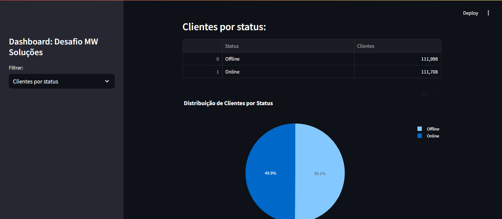

<h1 align="center">
    <a href="https://laravelcollective.com/tools/banner">
        
    </a>
</h1>

# 📝 Desafio MW Soluções

<p align="center"> Dashboard desenvolvido para o desafio proposto pela MW Soluções </p>

<h2 align="center">
  
  
  
</h2>

## 📌 Índice
<p align="center">         
  <a href="#tecnologias">Tecnologias </a> &nbsp; &nbsp; &nbsp; | &nbsp; &nbsp; &nbsp;        
  <a href="#instalação"> Instalação e Uso </a> &nbsp; &nbsp; &nbsp;
</p>          

## Tecnologias                                


## ⚙ Instalação   

### Clonagem

Primeiro, clone o repositório para seu ambiente:

```bash
> git clone https://github.com/Gabrielrc11/mw_desafio.git
```

Depois, entre no repositório clonado:

```bash
> cd mw_desafio
> 
```

Logo após, insira os seguintes comandos no seu terminal respectivamente para rodar a aplicação:

```bash
> streamlit run dashboard.py
```

Abra [http://localhost:8501/](http://localhost:8501/) no seu navegador para ver a aplicação.

Observação: não esqueça de iniciar as imagens e containers Docker!

-------------          

- [Voltar ao Início](#index)